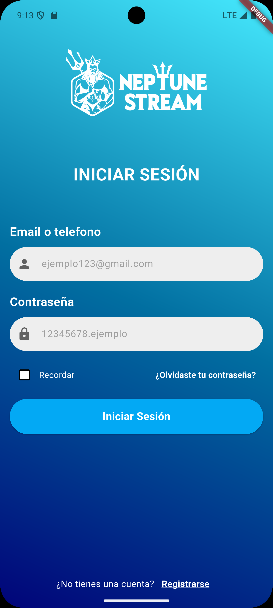
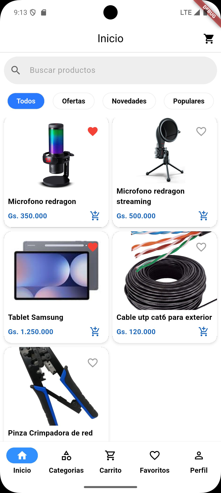
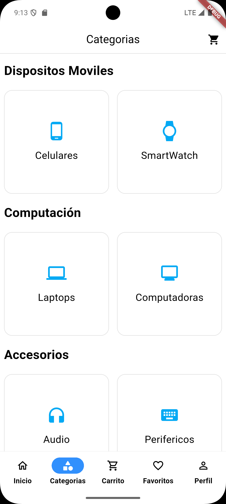
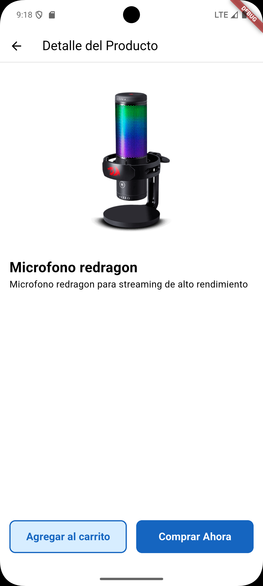
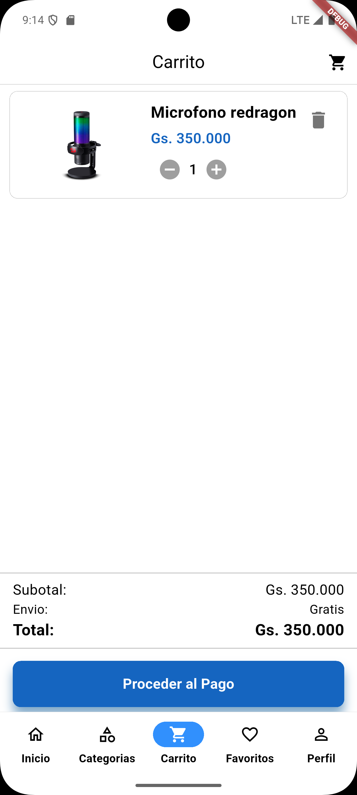
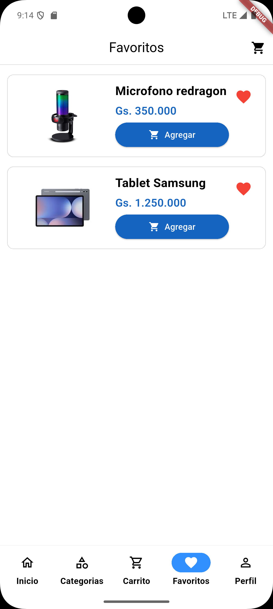

# 🛒 Flutter E-Commerce App

Flutter E-Commerce App es una aplicación móvil desarrollada en Flutter con construcción de interfaces, navegación y manejo de estados en una app de compras.
Actualmente, la app cuenta con pantallas de Login, Home, Detalle de Producto y Carrito. Utilizando Claean Architecture por feature. Se esta consumiendo una api basica de ecomerce.
Cuenta con autenticación y login, y persistencia de datos local para guardar sesion.
# Descripción
Esta app permite:
- Navegar entre pantallas de la app de manera fluida.
- Visualizar productos y sus detalles.
- Agregar productos al carrito.
- Pantalla de login y registro.

### Pantallas de la App

<table>
  <tr>
    <td></td>
    <td></td>
    <td></td>
  </tr>
  <tr>
    <td></td>
    <td></td>
    <td></td>
  </tr>
</table>

# 🔜 Próximos pasos
- Guardar datos del carrito en local storage o backend.
- Mejorar UI/UX y añadir animaciones.
- Manejo de errores y mensajes al usuario.
